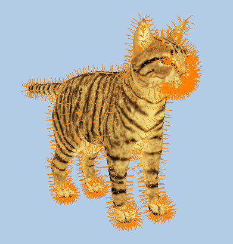
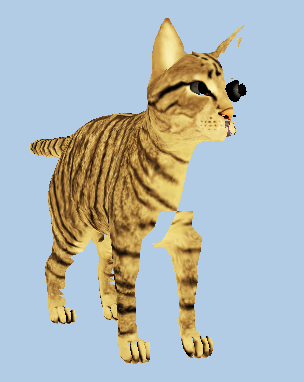
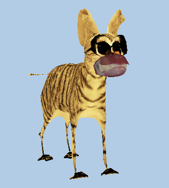

##*Introduction to Geometry shader programming*

-----
**CMake Build instructions**

-----
  - Out-of-source build :
 ```
git clone git@github.com:Modelisation5ETI/TP4_GeometryShader.git && \
mkdir TP4_GeometryShader-build && cd TP4_GeometryShader-build  && \
cmake ../TP4_GeometryShader  && \
make -j
 
 ```
  - QtCreator :
 ```
git clone git@github.com:Modelisation5ETI/TP4_GeometryShader.git  && \
mkdir TP4_GeometryShader-build && cd TP4_GeometryShader-build  && \
qtcreator ../TP4_GeometryShader
 
 ```
  *Then configure project using QtCreator API* : 
   - *Set the build directory to TP4_GeometryShader-build/*
   - *Run CMake and build project*


-----
**Implementation**

-----

 - ### Debug Normal
 

 ```
 ./_DebugNormal
 ```
 The geometry shader outputs a line for each vertex normal.
 
 Use arrows UP/DOWN to increase/decrease the normals size.
 
 - ### Culling
 

 ```
 ./_Culling
 ``` 
 Implement culling using geometry shader.
 
 Use arrow UP or DOWN to change the culling point position around the mesh.

 - ### Splitting
 

 ```
 ./_Splitting
 ```
Process different transformation using normals. Vertex and triangles are
modified by the geometry shader.
